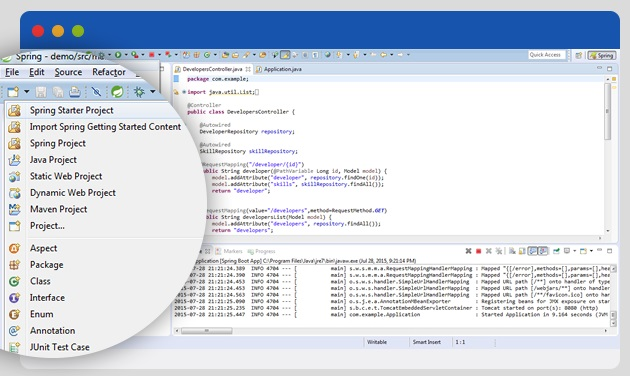

## How to try out the code

The easiest way to read through this code, try it out and play with it is to follow these instructions:
- download the Spring Tool Suite (http://spring.io/tools/sts/all) 
- open this project inside the Spring Tool Suite
- find the class Application in left side Package Explorer
- right click on class Application > Run as .. > Spring Boot App
- check the console on the bottom for something like "Started Application in 9.06 seconds"
- go to browser and the application should be running under http://localhost:8080/developers

That's all. :)

# Building an MVC Application with Spring Framework: A Beginner's Tutorial

Java is often said to be too complicated and to take too long to build simple applications. Nonetheless, Java provides a stable platform with a very mature ecosystem around it, which makes it a wonderful option for developing robust software.

The Spring Framework, one of the many powerful frameworks in the Java ecosystem, comes with a collection of programming and configuration models with a goal to simplify the development of performant and testable applications in Java.


In this tutorial, we will take the challenge of building a simple application that will act as a database of [software developers] using Spring Framework and the Java Persistence API (JPA).

The application follows a standard MVC architecture. It will have a controller (ContractsController class), views (based on Thymeleaf templates), and a model (a Java map object). For the sake of simplicity, we will use an in-memory database behind JPA to persist data while the application is running.

## Getting Started with the Spring Framework Tutorial

To build a Spring based application, we will need to use one of the following build tools:

-   Maven
-   Gradle

In this tutorial, we will use Maven. If you are not familiar with either of these tools, an easy way to get started is to download the [Spring Tool Suite](http://spring.io/tools/sts/all). The suite is dedicated for Spring Framework, and comes with its own [Eclipse](https://eclipse.org/) based IDE.

In Spring Tool Suite, we create a new project by selecting “Spring Starter Project” from under the “File > New” menu.



Once a new project has been created, we will need to edit the Maven configuration file, “_pom.xml_”, and add the following dependencies:

```xml
<dependency>
	<groupId>org.springframework.boot</groupId>
	<artifactId>spring-boot-starter-web</artifactId>
</dependency>
<dependency>
	<groupId>org.springframework.boot</groupId>
	<artifactId>spring-boot-starter-thymeleaf</artifactId>
</dependency>
<dependency>
	<groupId>org.springframework.boot</groupId>
	<artifactId>spring-boot-starter-data-jpa</artifactId>
</dependency>
<dependency>
	<groupId>com.h2database</groupId>
	<artifactId>h2</artifactId>
</dependency>
<dependency>
	<groupId>org.springframework.data</groupId>
	<artifactId>spring-data-commons</artifactId>
</dependency>

```

These listed dependencies will load Spring Boot Web, Thymeleaf, JPA, and H2 (which will serve as our in-memory database). All necessary libraries will be pulled automatically.

## Entity Classes

To be able to store information about developers and their skills, we will need to define two entity classes: “_Developer_” and “_Skill_”.

Both of these are defined as plain Java classes with some annotations. By adding “@Entity” before the classes, we are making their instances available to JPA. This will make it easier to store and retrieve instances from the persistent data store when needed. Additionally, the “@Id” and “@GeneratedValue” annotations allow us to indicate the unique ID field for the entity and have its value generated automatically when stored in the database.

As a developer can have many skills, we can define a simple many-to-many relationship using the “@ManyToMany” annotation.

#### Developer

```java
@Entity
public class Developer {

	@Id
	@GeneratedValue(strategy=GenerationType.AUTO)
	private long id;
	private String firstName;
	private String lastName;
	private String email;
	@ManyToMany
	private List<Skill> skills;

	public Developer() {
		super();
	}

	public Developer(String firstName, String lastName, String email,
			List<Skill> skills) {
		super();
		this.firstName = firstName;
		this.lastName = lastName;
		this.email = email;
		this.skills = skills;
	}

	public long getId() {
		return id;
	}

	public void setId(long id) {
		this.id = id;
	}

	public String getFirstName() {
		return firstName;
	}

	public void setFirstName(String firstName) {
		this.firstName = firstName;
	}

	public String getLastName() {
		return lastName;
	}

	public void setLastName(String lastName) {
		this.lastName = lastName;
	}

	public String getEmail() {
		return email;
	}

	public void setEmail(String email) {
		this.email = email;
	}

	public List<Skill> getSkills() {
		return skills;
	}

	public void setSkills(List<Skill> skills) {
		this.skills = skills;
	}

	public boolean hasSkill(Skill skill) {
		for (Skill containedSkill: getSkills()) {
			if (containedSkill.getId() == skill.getId()) {
				return true;
			}
		}
		return false;
	}

}

```

#### Skill

```java
@Entity
public class Skill {
    @Id
    @GeneratedValue(strategy=GenerationType.AUTO)
    private long id;
    private String label;
    private String description;

    public Skill() {
		super();
    }

    public Skill(String label, String description) {
		super();
		this.label = label;
		this.description = description;
	}

	public long getId() {
		return id;
	}

	public void setId(long id) {
		this.id = id;
	}

	public String getLabel() {
		return label;
	}

	public void setLabel(String label) {
		this.label = label;
	}

	public String getDescription() {
		return description;
	}

	public void setDescription(String description) {
		this.description = description;
	}
    
}

```

### Repositories

With JPA we can define a very useful DeveloperRepository interface and SkillRepository interface, which allow for easy CRUD operations. These interfaces will allow us to access stored developers and skills through simple method calls, such as:

-   “respository.findAll()”: returns all developers
-   “repository.findOne(id)”: returns developer with given ID

To create these interfaces, all we need to do is extend the CrudRepository interface.

#### Developer Repository

```java
public interface DeveloperRepository extends CrudRepository<Developer, Long> {

}

```

#### Skill Repository

```
public interface SkillRepository extends CrudRepository<Skill, Long> {
	public List<Skill> findByLabel(String label);
}

```

Functionality for the the additional method “_findByLabel_ “declared here will be provided automatically by JPA.

## Controller

Next, we can work on the controller for this application. The controller will map request URIs to view templates and perform all necessary processing in between.

```java
@Controller
public class DevelopersController {

	@Autowired
	DeveloperRepository repository;

	@Autowired
	SkillRepository skillRepository;

	@RequestMapping("/developer/{id}")
	public String developer(@PathVariable Long id, Model model) {
		model.addAttribute("developer", repository.findOne(id));
		model.addAttribute("skills", skillRepository.findAll());
		return "developer";
	}

	@RequestMapping(value="/developers",method=RequestMethod.GET)
	public String developersList(Model model) {
		model.addAttribute("developers", repository.findAll());
		return "developers";
	}

	@RequestMapping(value="/developers",method=RequestMethod.POST)
	public String developersAdd(@RequestParam String email, 
						@RequestParam String firstName, @RequestParam String lastName, Model model) {
		Developer newDeveloper = new Developer();
		newDeveloper.setEmail(email);
		newDeveloper.setFirstName(firstName);
		newDeveloper.setLastName(lastName);
		repository.save(newDeveloper);

		model.addAttribute("developer", newDeveloper);
		model.addAttribute("skills", skillRepository.findAll());
		return "redirect:/developer/" + newDeveloper.getId();
	}

	@RequestMapping(value="/developer/{id}/skills", method=RequestMethod.POST)
	public String developersAddSkill(@PathVariable Long id, @RequestParam Long skillId, Model model) {
		Skill skill = skillRepository.findOne(skillId);
		Developer developer = repository.findOne(id);

		if (developer != null) {
			if (!developer.hasSkill(skill)) {
				developer.getSkills().add(skill);
			}
			repository.save(developer);
			model.addAttribute("developer", repository.findOne(id));
			model.addAttribute("skills", skillRepository.findAll());
			return "redirect:/developer/" + developer.getId();
		}

		model.addAttribute("developers", repository.findAll());
		return "redirect:/developers";
	}

}

```

Mapping of URIs to methods is done via simple “@RequestMapping” annotations. In this case, every method of the controller is mapped to a URI.

The model parameter of these methods allows data to be passed to the view. In essence, these are simple maps of keys to values.

Each controller method either returns the name of the Thymeleaf template to be used as view, or a URL in a specific pattern (“redirect:”) to redirect to. For example, the methods “developer” and “_developersList_” returns the name of a template, while “developersAdd” and “developersAddSkill” return URLs to redirect to.

Within the controller, the “@Autowired” annotations automatically assigns a valid instance of our defined repository in the corresponding field. This allows access to relevant data from within the controller without having to deal with a lot of boilerplate code.

## Views

Finally, we need to define some templates for the views to be generated. For this we are using Thymeleaf, a simple templating engine. The model we used in controller methods is available directly within the templates, i.e. when we enter a contract into “_contract_” key in a model, we will be able to access the name field as “contract.name” from within the template.

Thymeleaf contains some special elements and attributes that control generation of HTML. They are very intuitive and straightforward. For example, to populate the contents of a span element with the name of a skill, all you need to do is define the following attribute (assuming that the key “_skill_” is defined in the model):

```
<span th:text="${skill.label}"></span>

```

Similarly to set the “_href_” attribute of an anchor element, the special attribute “_th:href_” can be used.

In our application, we will need two simple templates. For clarity, we will skip all style and class attributes (namely Bootstrap ones) here in the embedded template code.

#### Developer List


```java
<!DOCTYPE HTML>
<html xmlns:th="http://www.thymeleaf.org">
<head> 
	<title>Developers database</title> 
	<meta http-equiv="Content-Type" content="text/html; charset=UTF-8" />
</head>
<body>
	<h1>Developers</h1>
	<table>
		<tr>
			<th>Name</th>
			<th>Skills</th>
			<th></th>
		</tr>
		<tr th:each="developer : ${developers}">
			<td th:text="${developer.firstName + ' ' + developer.lastName}"></td>
			<td>
				<span th:each="skill,iterStat : ${developer.skills}">
					<span th:text="${skill.label}"/><th:block th:if="${!iterStat.last}">,</th:block>
				</span>
			</td>
			<td>
				<a th:href="@{/developer/{id}(id=${developer.id})}">view</a>
			</td>
		</tr>
	</table>
	<hr/>
	<form th:action="@{/developers}" method="post" enctype="multipart/form-data">
		<div>
			First name: <input name="firstName" />
		</div>
		<div>
			Last name: <input name="lastName" />
		</div>
		<div>
			Email: <input name="email" />
		</div>
		<div>
			<input type="submit" value="Create developer" name="button"/>
		</div>
	</form>
</body>
</html>

```

#### Developer Details


```java
<!DOCTYPE HTML>
<html xmlns:th="http://www.thymeleaf.org">
<head>
	<title>Developer</title>
	<meta http-equiv="Content-Type" content="text/html; charset=UTF-8" />
</head>
<body>
	<h1>Developer</h1>
	Name: <b th:text="${developer.firstName}" /> <b th:text="${developer.lastName}" /><br/>
	Email: <span th:text="${developer.email}" /><br/>
	Skills:
		<span th:each="skill : ${developer.skills}">
			<br/>&nbsp;&nbsp;<span th:text="${skill.label}" /> - <span th:text="${skill.description}" />
		</span>
	<form th:action="@{/developer/{id}/skills(id=${developer.id})}" method="post" enctype="multipart/form-data" >
		<select name="skillId">
			<option th:each="skill : ${skills}" 
				th:value="${skill.id}" 
				th:text="${skill.description}">Skill</option>
		</select>
		<input type="submit" value="Add skill"/>
	</form>
</body>
</html>

```

## Running the Server

Spring contains a boot module. This allows us to start the server easily from command line as a command line Java application:

```java
@SpringBootApplication
public class Application implements CommandLineRunner {

    @Autowired
    DeveloperRepository developerRepository;

    @Autowired
    SkillRepository skillRepository;

    public static void main(String[] args) {
        SpringApplication.run(Application.class, args);
    }

}

```

Since we are using an in-memory database, it makes sense to bootstrap the database with some predefined data at launch. That way we will have at least some data in the database when the server is up and running.

```
@Override
public void run(String... args) throws Exception {
	Skill javascript = new Skill("javascript", "Javascript language skill");
	Skill ruby = new Skill("ruby", "Ruby language skill");
	Skill emberjs = new Skill("emberjs", "Emberjs framework");
	Skill angularjs = new Skill("angularjs", "Angularjs framework");

	skillRepository.save(javascript);
	skillRepository.save(ruby);
	skillRepository.save(emberjs);
	skillRepository.save(angularjs);

	List<Developer> developers = new LinkedList<Developer>();
	developers.add(new Developer("John", "Smith", "john.smith@example.com", 
			Arrays.asList(new Skill[] { javascript, ruby })));
	developers.add(new Developer("Mark", "Johnson", "mjohnson@example.com", 
			Arrays.asList(new Skill[] { emberjs, ruby })));
	developers.add(new Developer("Michael", "Williams", "michael.williams@example.com", 
			Arrays.asList(new Skill[] { angularjs, ruby })));
	developers.add(new Developer("Fred", "Miller", "f.miller@example.com", 
			Arrays.asList(new Skill[] { emberjs, angularjs, javascript })));
	developers.add(new Developer("Bob", "Brown", "brown@example.com", 
			Arrays.asList(new Skill[] { emberjs })));
	developerRepository.save(developers);
}

```

## Conclusion

Spring is a versatile framework that allows building MVC applications. Building a simple application with Spring is quick and transparent. The application can also be integrated with a database easily using JPA.

The source code of this entire project is [available on GitHub](https://github.com/mekjr1/developersdatabase).
